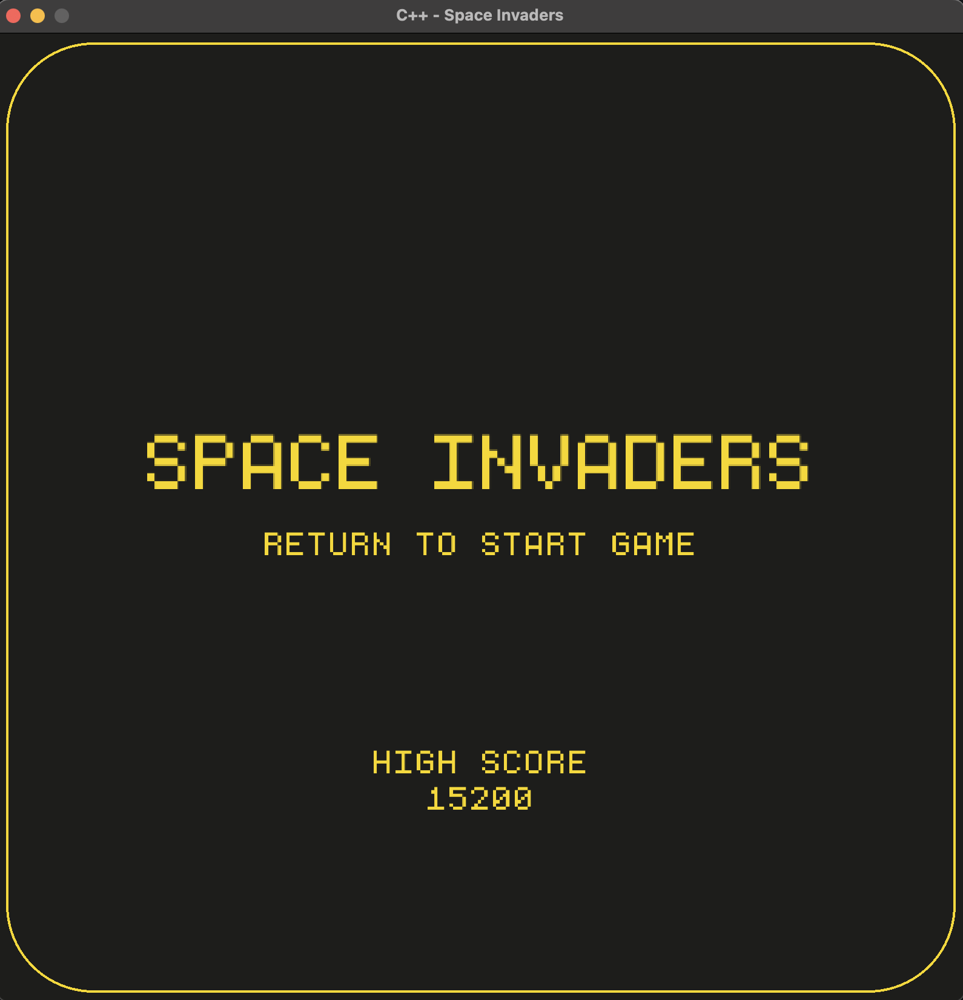
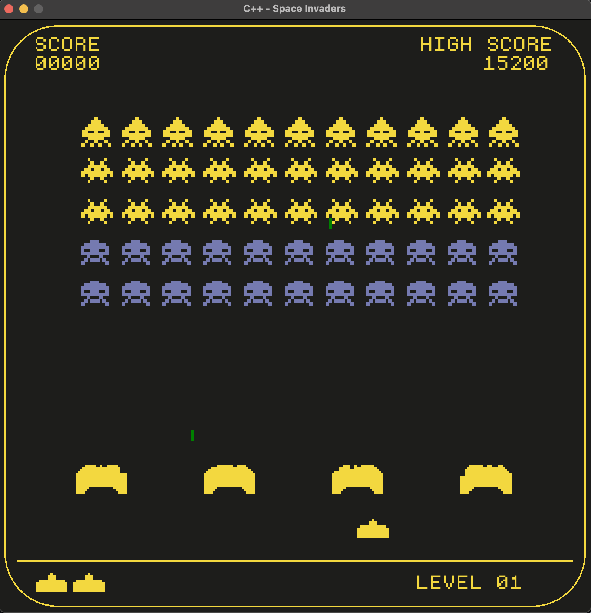
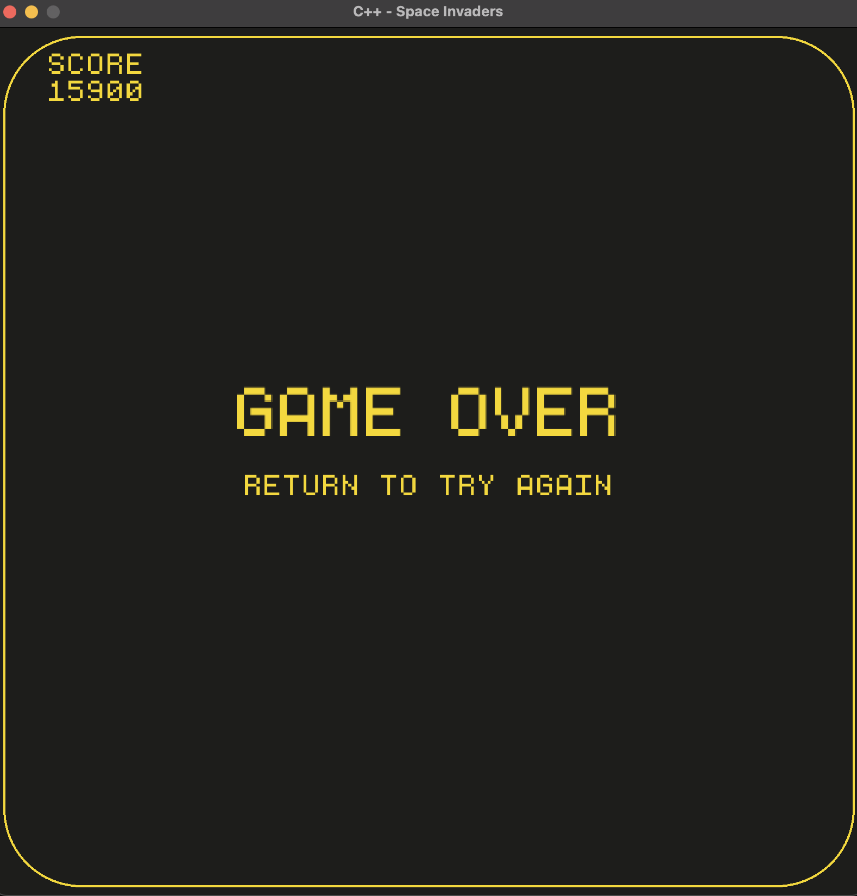
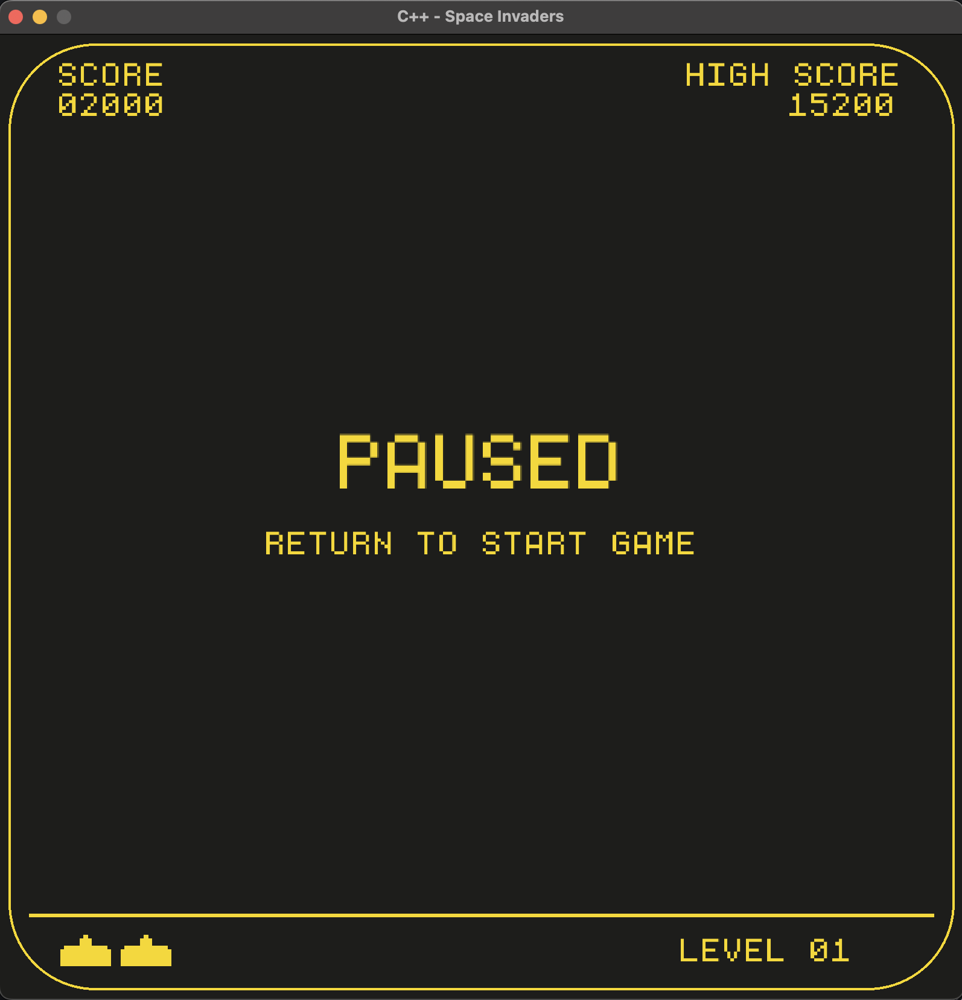

# space-invaders-cpp

A simple Space Invaders remake in C++, built as a weekend learning project.  

I followed along with [Programming with Nick](https://www.youtube.com/@programmingwithnick "Programming with Nick")’s tutorial as a foundation, but I also added my own tweaks and features to make it mine.

If you are new to C++ I highly recommend this tutorial, it is both digestible and informative,
providing OOP style coding practices, game dev basics, as well as general project management using
header files.

---

## Features
- Classic Space Invaders gameplay
- Retro graphics
- Score tracking + high score memory
- Simple/clean UI
- My own small additions (beyond the tutorial):
  - Pause / Game Over / Title screens
  - Levels
  - Game state managment through enums
  - Original audio files
  - Movement in Y direction

---

## Screenshots

### Title


### Game Play


### Game Over


### Paused


---

## Building & Running
Clone the repo and tweak to make.sh script to better suit your compiling needs.
I personally used vcpkg for dependency installation and management which you can install using the following.

``` bash 
git clone https://github.com/microsoft/vcpkg ~/dev/tools/vcpkg             
cd ~/dev/tools/vcpkg
# Microsoft uses telemtry to track user data which can slow down your CPU quite a bit
# So i opted for disabling it through the -disableMetrics flag
./bootstrap-vcpkg.sh -disableMetrics 

# Dependencies needed
./vcpkg install glfw3:arm64-osx
./vcpkg install raylib:arm64-osx
```

Then run the following commands and it should work, or make whichever changes are needed for your
system. I use a mac with arm64-osx so keep that in mind.

```bash
git clone https://github.com/aram2608/space-invaders-cpp.git
cd space-invaders-cpp
./make.sh
```